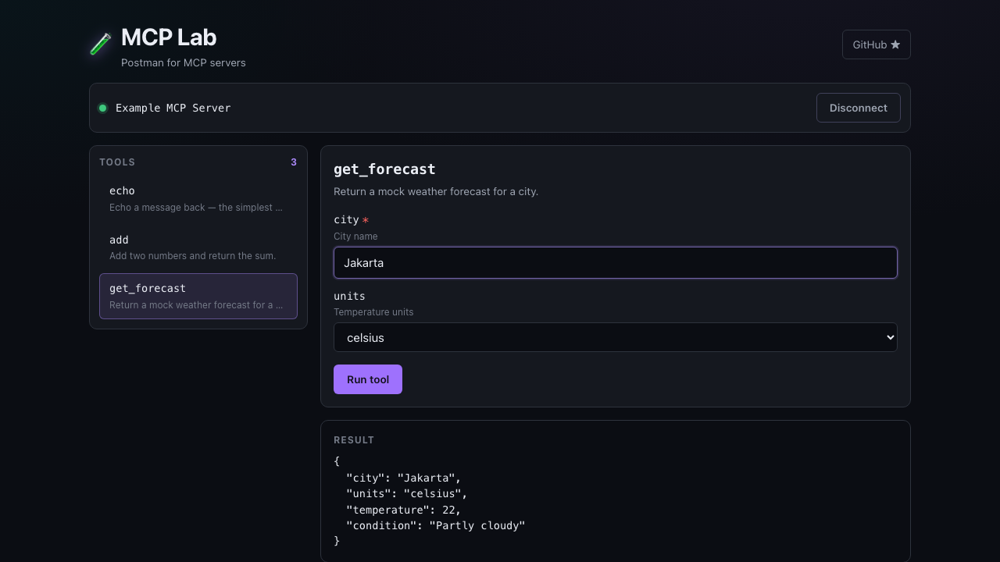

<div align="center">

# 🧪 MCP Lab

### Postman for MCP servers — connect, explore, and test any Model Context Protocol server from your browser.

[](https://github.com/ridzkyyy/mcp-lab/actions/workflows/ci.yml)
[](./LICENSE)
[](#contributing)




<!-- TODO before launch: record a short demo GIF and place it above the screenshot — motion converts better than a still. -->

**[▶ Live demo](https://mcp-lab.vercel.app) · [Quickstart](#quickstart) · [Roadmap](#roadmap)**

</div>

---

## What is this?

[MCP](https://modelcontextprotocol.io) servers expose tools, resources, and prompts to AI agents — but testing one today means wiring it into a client or squinting at raw JSON-RPC. **MCP Lab is a clean web UI that lets you point at any MCP server and actually *use* it:** list its tools, fill in arguments through a generated form, fire a call, and read the result formatted — not as a wall of JSON.

Think Postman, but speaking MCP instead of HTTP.

## Why you'd want it

- 🔌 **Connect in seconds** — paste an MCP server URL (HTTP / SSE / Streamable HTTP), no install
- 🧰 **Explore everything** — tools, resources, and prompts in one panel
- 📝 **Typed argument forms** — auto-generated from each tool's input schema, with validation
- 📦 **Save & share collections** — keep your common calls, share a link with a teammate
- 🌗 **Designed, not default** — readable result rendering, light/dark, keyboard-first

## Quickstart

```bash
git clone https://github.com/ridzkyyy/mcp-lab.git
cd mcp-lab
npm install
npm run dev
```

Open `http://localhost:5173`, paste an MCP server endpoint, and start calling tools.

> Trying it out? Spin up any HTTP-transport MCP server (or use the bundled example endpoint) and connect.

## How it works

```
Browser (MCP Lab)  ──HTTP/SSE──▶  MCP server  ──▶  tools · resources · prompts
        ▲                                                   │
        └───────────── formatted results ◀──────────────────┘
```

MCP Lab talks the MCP protocol directly over HTTP-based transports. (stdio servers need a local bridge — that's on the [roadmap](#roadmap).)

## Roadmap

- [x] Connect to HTTP / SSE MCP servers
- [x] List & invoke tools with schema-generated forms
- [ ] Resources & prompts panels
- [ ] Save / export / share request collections
- [ ] stdio transport via local bridge
- [ ] Auth presets (headers, bearer tokens)
- [ ] Request history & diffing

See [ROADMAP.md](./ROADMAP.md) for detail.

## Contributing

Issues and PRs welcome — especially transport adapters, schema-form edge cases, and result renderers. See [ROADMAP.md](./ROADMAP.md) for where help lands best.

## License

[MIT](./LICENSE)
